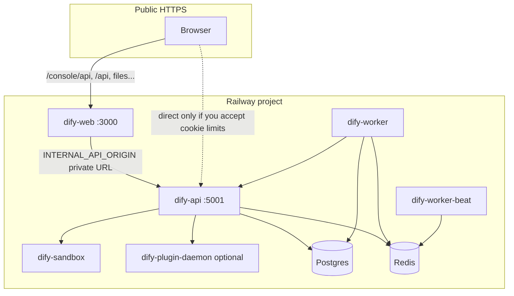

# Deploying Dify on Railway

This guide describes how to run **Dify Community Edition** on [Railway](https://railway.com): services to provision, environment variables, **same-origin console authentication** (required on `*.up.railway.app`), Celery worker/beat, and how this setup relates to **Railway templates**.

For generic Docker Compose self-hosting, see [`docker/README.md`](../../docker/README.md) and [`docker/.env.example`](../../docker/.env.example).

---

## Why this repository’s web build matters on Railway

Railway gives each service a hostname such as `dify-web-production.up.railway.app` and `dify-api-production.up.railway.app`. The suffix **`up.railway.app` is on the [Public Suffix List](https://publicsuffix.org/)**, so those hosts are treated as **different sites**. Browser cookies cannot be shared across them using a parent `Domain=` attribute, and `SameSite=Lax` session cookies from the API hostname will not be sent to the web hostname.

This fork adds an **internal reverse proxy** in the Next.js app so the browser only talks to the **web** origin for `/console/api`, `/api`, `/files`, `/v1`, `/mcp`, and `/triggers`. The server forwards requests to the API over Railway private networking.

**Deploy the `web` service from this repo** (Docker build context `web/`), not only the stock `langgenius/dify-web` image, unless you have merged the same proxy behavior.

---

## Architecture



- **dify-web**: Next.js; must set `INTERNAL_API_ORIGIN` to the API’s **internal** base URL.
- **dify-api**: Gunicorn + Flask API (`MODE` unset or default).
- **dify-worker**: Celery worker (`MODE=worker`).
- **dify-worker-beat**: Celery beat (`MODE=beat`); **only one** replica.
- **Postgres** / **Redis**: Railway database plugins or your own.
- **dify-sandbox**: Official `langgenius/dify-sandbox` image (code execution).
- **dify-plugin-daemon** (optional): Official `langgenius/dify-plugin-daemon` if you use the plugin system.

---

## Prerequisites

- Railway account and a **project** (e.g. one environment: `production` or `development`).
- Railway [CLI](https://docs.railway.com/guides/cli) optional, for deploys from a monorepo (`railway link`, `railway up`).

---

## 1. Add Postgres and Redis

1. In the project, add **PostgreSQL** and **Redis** (Railway templates or “New” → Database).
2. Note each service’s **variables** (e.g. `DATABASE_URL`, `REDIS_URL`). You will reference them on the API and workers.

Use the **same** Postgres and Redis for `dify-api`, `dify-worker`, and `dify-worker-beat`.

---

## 2. Service: `dify-api`

| Setting | Value |
|--------|--------|
| **Source** | Docker image `langgenius/dify-api:<version>` (match your desired Dify release, e.g. `1.13.2`) |
| **Public networking** | Generate a domain (HTTPS) — used for `CONSOLE_API_URL` / `SERVICE_API_URL` / `APP_API_URL` **if** clients hit the API directly. With the web proxy, the browser mainly uses the **web** URL; these should still be the **public HTTPS** API URL for links, CORS, and server-side logic. |

### Required environment variables (minimal set)

Copy patterns from [`docker/.env.example`](../../docker/.env.example). On Railway, prefer **[reference variables](https://docs.railway.com/variables#reference-variables)** so URLs stay correct when Railway rotates credentials.

**URLs (use your real generated domains, `https://`):**

- `CONSOLE_WEB_URL` — public web UI, e.g. `https://dify-web-xxx.up.railway.app`
- `CONSOLE_API_URL` — public API, e.g. `https://dify-api-xxx.up.railway.app`
- `SERVICE_API_URL` — usually same as `CONSOLE_API_URL`
- `APP_WEB_URL` — often same as `CONSOLE_WEB_URL`
- `APP_API_URL` — often same as `CONSOLE_API_URL`
- `FILES_URL` — **must be reachable for file features**; with same-origin proxy, set to the **web** origin, e.g. `https://dify-web-xxx.up.railway.app` (see upstream comments in `.env.example`).
- `TRIGGER_URL` — public base for triggers; often same as `SERVICE_API_URL` or web origin depending on how you expose `/triggers`.

**Cookie / PSL note:** leave **`COOKIE_DOMAIN` empty** (or unset). Setting it to `up.railway.app` causes browsers to **reject** auth cookies. With an empty domain, the API emits host-only or appropriate cookies; the web proxy re-applies `Set-Cookie` without forwarding an invalid parent domain.

**Database / broker:**

- `DB_*` or `SQLALCHEMY_DATABASE_URI` / Railway’s `DATABASE_URL` mapping per Dify docs
- `CELERY_BROKER_URL` — Redis, e.g. `${{Redis.REDIS_URL}}` with DB index `/1` if that matches your compose convention
- `CELERY_RESULT_BACKEND` — often same Redis or `redis://...`

**Migrations:**

- `MIGRATION_ENABLED=true` **only** on the **API** service for first boot / upgrades, or run a **one-off** deploy with `MODE=migration` (see [`api/docker/entrypoint.sh`](../../api/docker/entrypoint.sh)). Avoid running migrations simultaneously from **worker** and **beat** (`MIGRATION_ENABLED=false` there).

**Sandbox / plugins (if enabled):**

- `CODE_EXECUTION_ENDPOINT` pointing to internal sandbox URL, e.g. `http://dify-sandbox.railway.internal:8194`
- Plugin daemon host/keys per `docker/.env.example`

### Healthcheck (recommended)

Use an HTTP health path if you add one, or rely on Railway’s default; ensure the process listens on `5001` (see API Dockerfile `EXPOSE`).

---

## 3. Service: `dify-web`

| Setting | Value |
|--------|--------|
| **Source** | **GitHub**: this repository, **Root directory** `web` (monorepo), **Dockerfile** `web/Dockerfile` — or equivalent “Docker build” with context `web`. |
| **Public networking** | Generate domain — this is what users open in the browser. |

### Critical variables

| Variable | Purpose |
|----------|---------|
| `INTERNAL_API_ORIGIN` | Internal API base URL, **no trailing path**. Example: `http://dify-api.railway.internal:5001`. Replace `dify-api` with your **exact** Railway service name (DNS name in private network). |
| `CONSOLE_API_URL` | Public **HTTPS** URL of the API (used by entrypoint when `INTERNAL_API_ORIGIN` is unset). When `INTERNAL_API_ORIGIN` is set, entrypoint forces same-origin prefixes; you should still set consistent public URLs for any server-side or build-time needs. |
| `APP_API_URL` | Public **HTTPS** API URL for webapp API prefix logic. |

Behavior is implemented in [`web/docker/entrypoint.sh`](../../web/docker/entrypoint.sh): when `INTERNAL_API_ORIGIN` is non-empty, `NEXT_PUBLIC_API_PREFIX=/console/api`, `NEXT_PUBLIC_PUBLIC_API_PREFIX=/api`, and `NEXT_PUBLIC_COOKIE_DOMAIN` is cleared.

See also [`web/.env.example`](../../web/.env.example).

### CLI deploy from repo root (monorepo)

If the Railway service is linked to `dify-web`:

```bash
railway up --path-as-root -s dify-web --no-gitignore --ci
```

(`--path-as-root` makes the Docker build context `web/`; include `--no-gitignore` only if you must ship untracked files — prefer committing them.)

---

## 4. Service: `dify-worker`

| Setting | Value |
|--------|--------|
| **Source** | Same image as API: `langgenius/dify-api:<version>` |
| **Start** | Default entrypoint uses `MODE` from env |

Set:

- `MODE=worker`
- Same DB, Redis, `SECRET_KEY`, and core config as **dify-api** (copy variable references).
- `MIGRATION_ENABLED=false` (recommended) so workers do not race `flask upgrade-db`.

See [`api/docker/entrypoint.sh`](../../api/docker/entrypoint.sh) (`MODE=worker`).

---

## 5. Service: `dify-worker-beat`

| Setting | Value |
|--------|--------|
| **Source** | `langgenius/dify-api:<version>` |
| **Replicas** | **1** only (multiple beat processes duplicate schedules). |

Set:

- `MODE=beat`
- Same broker/DB/`SECRET_KEY` as API
- `MIGRATION_ENABLED=false`

---

## 6. Service: `dify-sandbox`

Use image `langgenius/dify-sandbox:<version>`. Configure API env vars (`CODE_EXECUTION_ENDPOINT`, etc.) to the sandbox **internal** URL and port per upstream documentation.

---

## 7. Optional: `dify-plugin-daemon`

Use `langgenius/dify-plugin-daemon` and variables from `docker/.env.example` if you need the plugin marketplace/runtime.

---

## 8. Deploy order (recommended)

1. Postgres + Redis live and variables available.
2. **dify-api** first: run migrations (`MIGRATION_ENABLED=true` once or `MODE=migration`), confirm logs clean.
3. **dify-web** with `INTERNAL_API_ORIGIN` pointing at API internal URL.
4. **dify-worker**, then **dify-worker-beat** (or worker before beat is fine if broker is up).
5. **dify-sandbox** (and plugin daemon) if used.

---

## 9. First login

Open the **web** public URL → `/install` (if uninitialized) or `/signin`.

Verify in browser devtools that API calls go to **`https://<web-host>/console/api/...`** (same origin), not only to the API hostname.

---

## 10. Troubleshooting

| Symptom | Likely cause |
|---------|----------------|
| Login returns 200 but immediate 401 on `/console/api/account/profile` | Cookies not stored: was `COOKIE_DOMAIN=up.railway.app`, or missing proxy / wrong `INTERNAL_API_ORIGIN`. Use this repo’s web image and empty `COOKIE_DOMAIN`. |
| Worker/beat exit on start | Wrong `CELERY_BROKER_URL`, DB unreachable, or `MIGRATION_ENABLED=true` failing on worker — check deploy logs. |
| 502 on `/console/api/*` | `INTERNAL_API_ORIGIN` wrong service name or port; API not on private network. |
| Files broken | `FILES_URL` must match how the browser reaches file routes (often web origin when proxied). |

---

## Railway templates: can this be a one-click deploy?

**Yes.** Railway supports **templates** that bundle multiple services, variables, and settings so anyone can redeploy the stack from a button or URL.

### How templates work (high level)

- **Create from a working project:** Project → **Settings** → **Generate Template from Project** → **Create Template**. Railway opens the template composer with your services pre-filled. See [Creating a template](https://docs.railway.com/guides/create).
- **Create from scratch:** Workspace → [Templates](https://railway.com/workspace/templates) → **New Template**, add each service (GitHub repo or Docker image), set variables and **root directory** (`web` for the frontend monorepo path).
- **Publish:** You can [publish and share](https://docs.railway.com/templates/publish-and-share) to the [template marketplace](https://railway.com/templates); open-source projects may qualify for [kickbacks](https://docs.railway.com/templates/kickbacks).

### What to configure in the template

- **Postgres + Redis** as template services (or document that users must add them and wire references).
- **Variable references** like `${{Postgres.DATABASE_URL}}` / `${{Redis.REDIS_URL}}` so new deploys get correct wiring.
- **dify-web** service: source = GitHub repo with **Root directory** `web`; set `INTERNAL_API_ORIGIN` to the **internal** URL of the API service (Railway’s private DNS name for that service + `:5001`).
- **dify-api**, **dify-worker**, **dify-worker-beat**: Docker image `langgenius/dify-api` with `MODE` and `MIGRATION_ENABLED` as above.
- **Public URLs**: either document that users must set `CONSOLE_WEB_URL`, `CONSOLE_API_URL`, etc. after domains are generated, or use template/placeholder flows Railway documents for “required variables” on deploy.

### Limitations to be aware of

- Template definitions are managed in the **Railway dashboard** (template composer), not as a portable `template.json` checked into this repo. There is no official “import template from repo JSON” workflow documented as a first-class file format.
- **Custom web code** (this proxy) must come from **your fork or this repo** in the template; the stock `langgenius/dify-web` Docker image alone does not include `INTERNAL_API_ORIGIN` routing described here.
- **Version pinning:** Pin `langgenius/dify-api` / sandbox / plugin images to explicit tags so template users don’t get surprise major upgrades.

### Summary

| Question | Answer |
|----------|--------|
| Can this stack be a Railway template? | **Yes** — multi-service templates are supported. |
| Easiest path? | Deploy once correctly → **Generate Template from Project** → adjust variables and docs → publish or share template URL. |
| Is it in-repo as code? | **No** — template metadata lives in Railway; link users to your published template URL from this README or Dify docs. |

---

## References

- [Railway: Create a template](https://docs.railway.com/guides/create)
- [Railway: Deploy a template](https://docs.railway.com/guides/deploy)
- [Railway: Variables & reference variables](https://docs.railway.com/variables)
- [Railway: Monorepo / root directory](https://docs.railway.com/deployments/monorepo)
- Dify: [`docker/.env.example`](../../docker/.env.example), [`web/.env.example`](../../web/.env.example)
